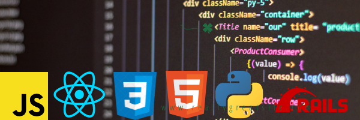
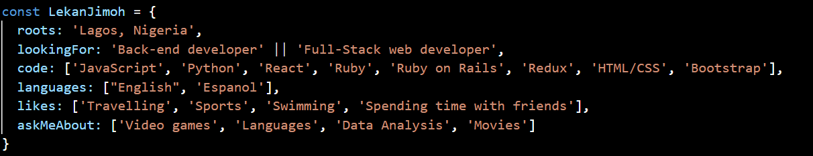

### Hello 👋, I'm Lekan Jimoh

[](https://www.linkedin.com/in/lekanj/)
[](https://twitter.com/d2ndjim_)

### About Me

I am a full time student at Microverse, learning Full Stack Web Development. I like to meet, learn from and collaborate with people.

### More about me



```text
    🔥 Editors:
VS Code
████████████████████████

💻 Operating System:
Mac OS
█████████████████████████
```


<!--
**d2ndjim/d2ndjim** is a ✨ _special_ ✨ repository because its `README.md` (this file) appears on your GitHub profile.

Here are some ideas to get you started:

- 🔭 I’m currently working on ...
- 🌱 I’m currently learning ...
- 👯 I’m looking to collaborate on ...
- 🤔 I’m looking for help with ...
- 💬 Ask me about ...
- 📫 How to reach me: ...
- 😄 Pronouns: ...
- ⚡ Fun fact: ...
-->
